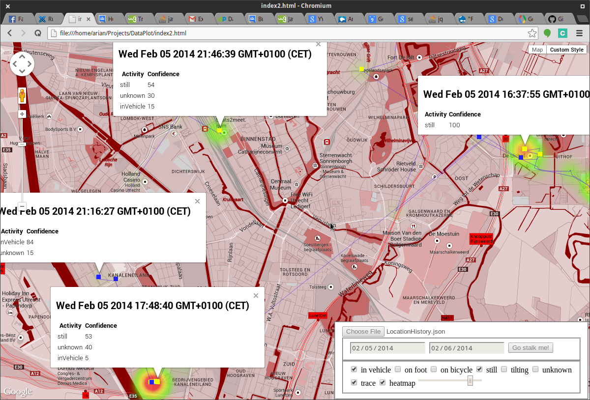

GoogleStalker
=============

Google stalker is a tool to make you realize how much data google collects about you.

Google allows you to download all the data they have on you, but for the average person (non-techy), this data is just gibberish. Google stalker visualizes the Location data that Google provides using heatmaps, traces, and location markers.

== Privacy notice
Google stalker fully runs clientside. All the data you provide to Google stalker is only visible to the browser locally. If you don't trust me (maybe you shouldn't ;-)), you can download the code from my github and run it locally yourself. For this you will need a Google Maps API key (Available here: ).

== Intructions

First get a copy of your location from <a href="https://www.google.com/settings/takeout/custom">Google Takout</a> You do this by creating a new archive and just selecting the "Location History" checkbox

Once the archive is ready, download and unzip it. now hit the browse files button on this webpage and find the folder where you extracted the archive and select "LocationHistory.json"

Now select a date range that you're interested in. By default Google Stalker will select the biggest range available, but beware that we're crunching a lot of data, so the more data you import, the longer the loading times are gonna be

Hit "Go stalk me!" and wait.. The browser might seem irresponsive for a while because a lot of data (> 100k entries) are loaded into google maps. The bigger your date range, the slower the process

Finally a map will be presented to you. You can add markers like "in vehicle" and "on foot" through the settings. When you click on the markers, extra information will be provided<

== Example

In this screenshot you can clearly see what I was doing on the 5th of February. I went to the university campus at 16:37. I was at the IKEA at 17:48 and seemed to have spent quite some time there. I was at the train station at 21:46... etc etc.

